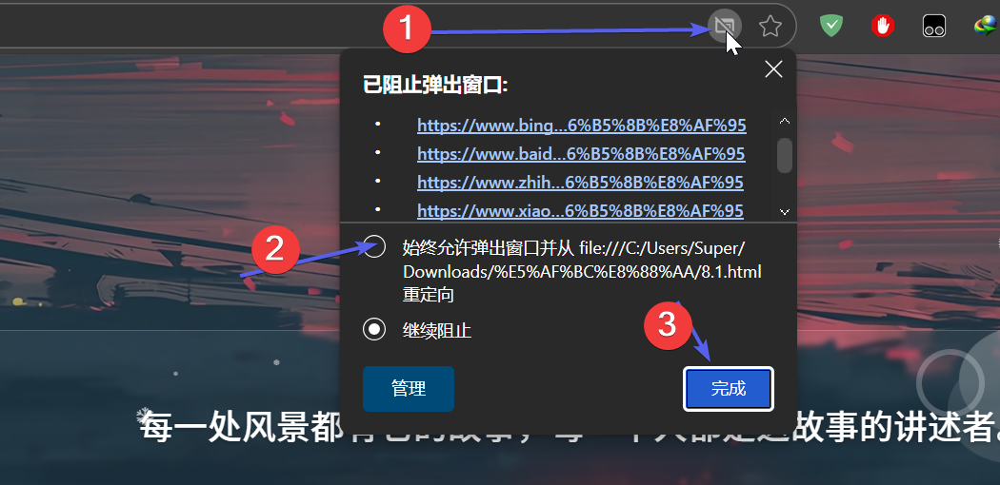
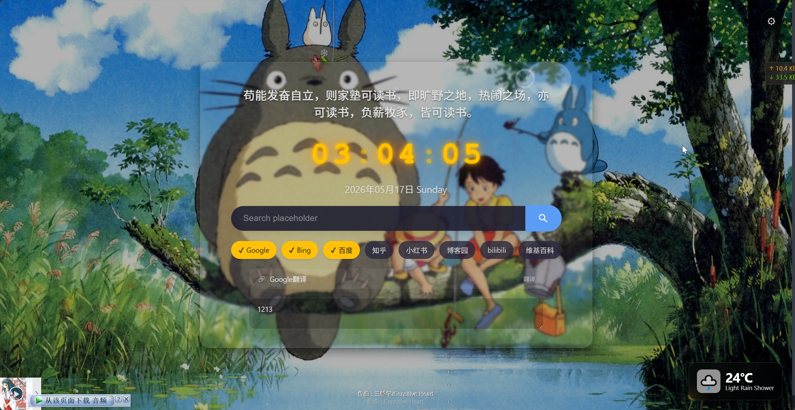
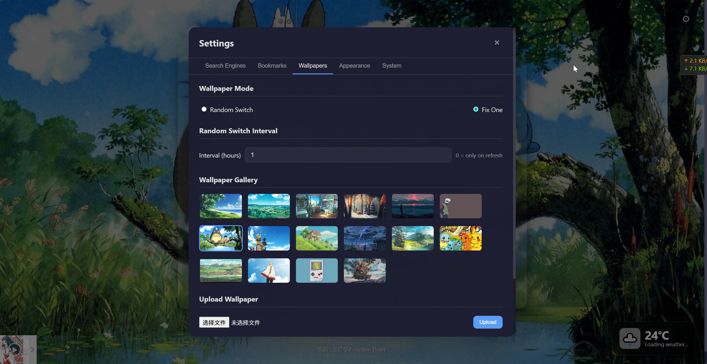
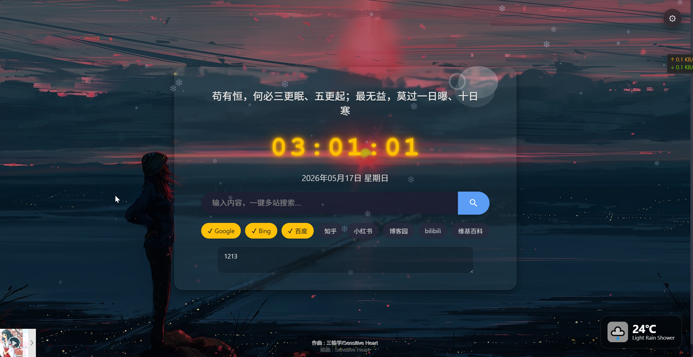
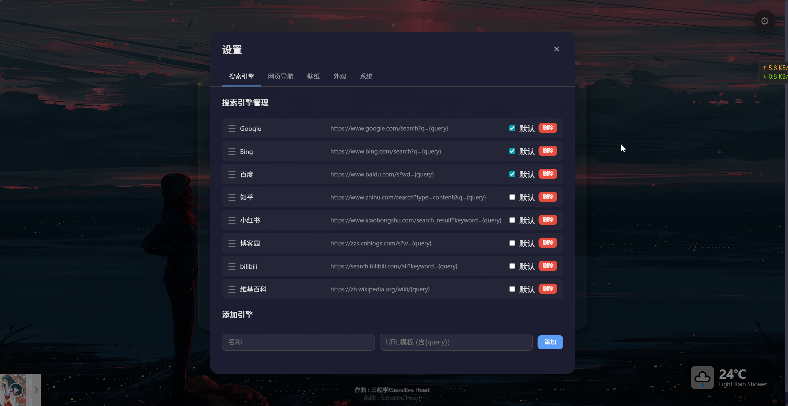
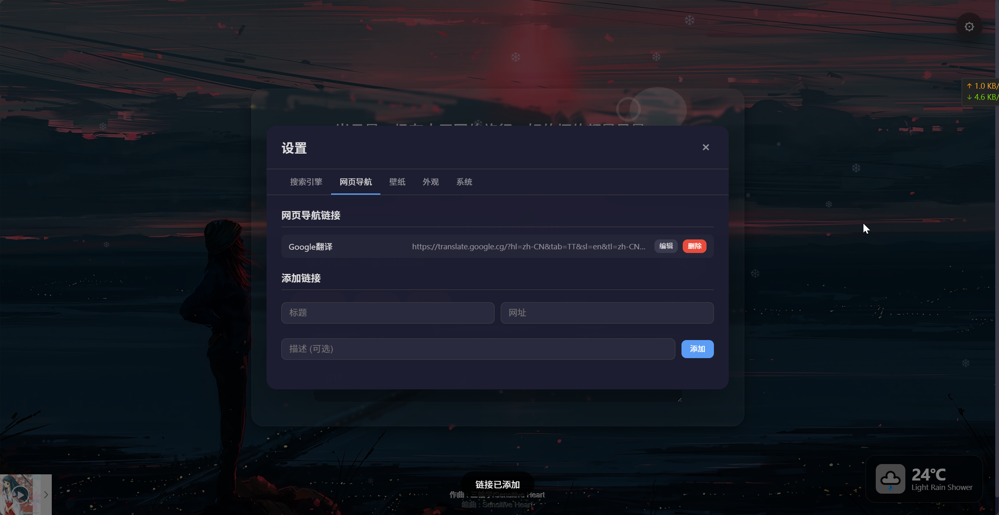
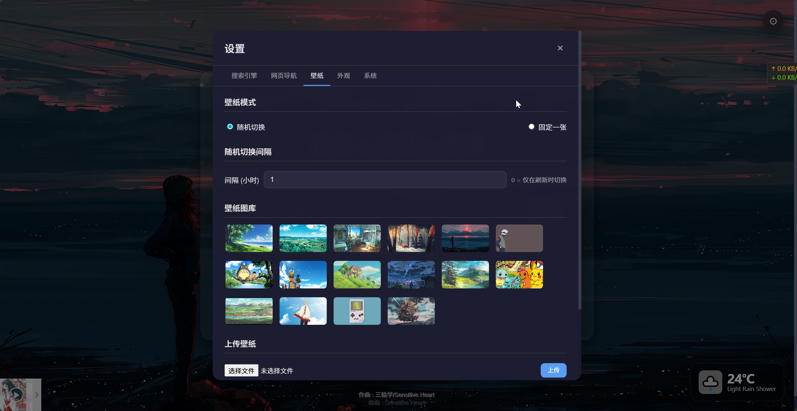
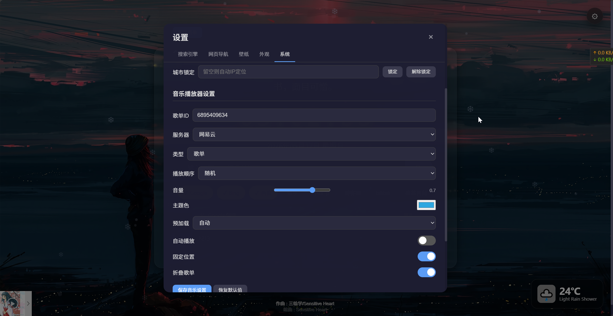

<p align="center">
  
</p>

<h1 align="center">my-search-page</h1>

<p align="center">
  A beautiful, customizable browser start page &mdash; multi-engine search, bookmarks, weather, memo, music, wallpaper rotation.
</p>

<p align="center">
  <a href="https://github.com/pixelpulse0x1/my-search-page"></a>
  <a href="https://hub.docker.com/r/pixelpulse01/my-search-page"></a>
  
  
</p>

---

## English

### Features

- **Multi-engine search** — 8 built-in search engines (Google, Bing, Baidu, Zhihu, Bilibili…), selectable with one click. Add / delete / reorder from settings.
- **Bookmarks panel** — Web navigation links shown as a clean table at the bottom. Add / edit / delete from settings.
- **Weather widget** — Bottom-right glass-morphism panel. Click to expand details (feels like, humidity, wind, visibility, pressure, UV, sunrise, sunset, moon phase). Fetches directly from [wttr.in](https://wttr.in) in the browser.  ==When filling in the weather location, you need to enter the English name of the region.==
- **Memo** — Sticky note with 1-second debounced auto-save.
- **Wallpaper system** — 16 default wallpapers + user upload. Random rotation with configurable interval. Fixed mode. Delete management.
- **Music player** — Embedded APlayer with NetEase / QQ / Kugou support. Fully configurable (playlist ID, server, order, volume, theme…).
- **Daily quotes** — Random rotation with configurable interval.
- **Nixie-tube clock** — Retro glow effect, 12h / 24h switchable.
- **Dark mode** — Light / Dark / Follow-system.
- **Glass morphism** — Adjustable background opacity & blur.
- **Data backup** — One-click full-data ZIP export.
- **i18n** — Simplified Chinese & English, switchable in settings.
- **Click effects & snowflakes** — Subtle visual delight.
- **Docker deployment** — Single container, persistent `/data` volume.

- After clicking search or pressing Enter, all selected websites will open their search results simultaneously in a new tab, greatly improving information retrieval efficiency.

  > This part requires enabling multi-window pop-up permissions. The first time, search for any content, and then allow it once for it to take effect permanently.
  >
  > 







### Quick Start

#### Docker run

```bash
docker run -d \
  --name my-search-page \
  -p 9050:3150 \
  -v /opt/docker-stacks/my-search-page:/data \
  -e TZ=Asia/Shanghai \
  -e SECRET_KEY=your-random-secret-key \
  pixelpulse01/my-search-page:v0.2.3.0
```

Then open **http://localhost:9050**.

#### Docker Compose

Create `docker-compose.yml`:

```yaml
version: "3.8"

services:
  my-search-page:
    image: pixelpulse01/my-search-page:v0.2.3.0
    container_name: my-search-page
    restart: unless-stopped

    environment:
      - TZ=Asia/Shanghai
      - SECRET_KEY=change-me-to-a-random-string

    ports:
      - "9050:3150"

    volumes:
      - /opt/docker-stacks/my-search-page:/data
```

Then:

```bash
docker-compose up -d
```

### Volume structure

```
/opt/docker-stacks/my-search-page/
├── database/main.db       # SQLite
├── backgrounds/           # Default wallpapers (16 images)
├── wallpapers/            # User-uploaded wallpapers
├── icons/                 # Bookmark icons
├── json/
│   ├── settings.json      # All settings
│   ├── quotes.json        # Daily quotes
│   └── lang_zh.json       # Chinese translations
├── log/app.log            # Application log
└── exports/               # Backup exports
```

### Environment variables

| Variable | Default | Description |
|----------|---------|-------------|
| `TZ` | `Asia/Shanghai` | Container timezone |
| `SECRET_KEY` | random | Flask session signing key |

### Tech stack

| Layer | Technology |
|-------|-----------|
| Backend | Python 3.12, Flask 3.0 |
| Database | SQLite (WAL mode) |
| Frontend | Vanilla JS (ES6+), CSS Variables |
| Music | APlayer + MetingJS (CDN) |
| Weather | wttr.in (browser-side fetch) |
| Deploy | Docker, docker-compose |

### Browser support

All modern browsers (Chrome, Firefox, Safari, Edge).

---

## 简体中文

### 功能特性

- **多引擎聚合搜索** — 内置 8 个搜索引擎（Google / Bing / 百度 / 知乎 / bilibili…），一键多站搜索。可在设置中增删改、排序、设为默认。
- **网页导航** — 底部表格形式展示书签链接，支持增删改。
- **天气桌面挂件** — 右下角玻璃拟态面板，点击展开详情（体感温度、湿度、风向、能见度、气压、UV、日出日落、月相）。浏览器端直连 [wttr.in](https://wttr.in)。==天气位置填写时，需要填入地区的英文名称== 
- **便签** — 1 秒防抖自动保存，随手记录。
- **壁纸系统** — 16 张默认壁纸 + 用户上传，随机轮换间隔可设，固定模式，删除管理。
- **音乐播放器** — 内嵌 APlayer，支持网易云 / QQ / 酷狗，歌单 ID、服务器、播放顺序、音量、主题色全可配。
- **每日语录** — 随机轮换，切换间隔可设。
- **辉光管时钟** — 复古辉光效果，12/24 小时制切换。
- **暗色模式** — 浅色 / 深色 / 跟随系统。
- **玻璃拟态** — 内容区透明度与模糊度实时可调。
- **一键备份** — 全量数据打包 ZIP 导出。
- **多语言** — 简体中文 / English，设置中随时切换。
- **点击特效 & 飘雪** — 轻量视觉点缀。
- **Docker 部署** — 单容器运行，`/data` 卷持久化。

- 点击搜索或按下回车后，所有被选中的网站将**同时在新标签页中打开**搜索结果，极大地提升了信息检索效率。

  > 这一部分需要开启多窗口弹出允许，第一次随意搜索内容，然后允许一次即可永久生效：
  >
  > 













### 快速开始

#### Docker 命令安装

```bash
docker run -d \
  --name my-search-page \
  -p 9050:3150 \
  -v /opt/docker-stacks/my-search-page:/data \
  -e TZ=Asia/Shanghai \
  -e SECRET_KEY=your-random-secret-key \
  pixelpulse01/my-search-page:v0.2.3.0
```

浏览器访问 **http://localhost:9050**。

#### Docker Compose 安装

创建 `docker-compose.yml`：

```yaml
version: "3.8"

services:
  my-search-page:
    image: pixelpulse01/my-search-page:v0.2.3.0
    container_name: my-search-page
    restart: unless-stopped

    environment:
      - TZ=Asia/Shanghai
      - SECRET_KEY=change-me-to-a-random-string

    ports:
      - "9050:3150"

    volumes:
      - /opt/docker-stacks/my-search-page:/data
```

执行：

```bash
docker-compose up -d
```

### 数据目录结构

```
/opt/docker-stacks/my-search-page/
├── database/main.db       # SQLite 数据库
├── backgrounds/           # 默认壁纸 (16 张)
├── wallpapers/            # 用户上传壁纸
├── icons/                 # 书签图标
├── json/
│   ├── settings.json      # 系统设置
│   ├── quotes.json        # 励志语录
│   └── lang_zh.json       # 中文翻译文件
├── log/app.log            # 应用日志
└── exports/               # 备份导出
```

### 环境变量

| 变量 | 默认值 | 说明 |
|------|--------|------|
| `TZ` | `Asia/Shanghai` | 容器时区 |
| `SECRET_KEY` | random | Flask Session 签名密钥 |

### 技术栈

| 层级 | 技术 |
|------|------|
| 后端 | Python 3.12, Flask 3.0 |
| 数据库 | SQLite (WAL 模式) |
| 前端 | 原生 JavaScript (ES6+), CSS Variables |
| 音乐 | APlayer + MetingJS (CDN) |
| 天气 | wttr.in (浏览器端直连) |
| 部署 | Docker, docker-compose |

### 浏览器兼容

所有现代浏览器（Chrome、Firefox、Safari、Edge）。

---

**GitHub**: [https://github.com/pixelpulse0x1](https://github.com/pixelpulse0x1)

**Docker Hub**: `docker pull pixelpulse01/my-search-page:v0.2.3.0`
